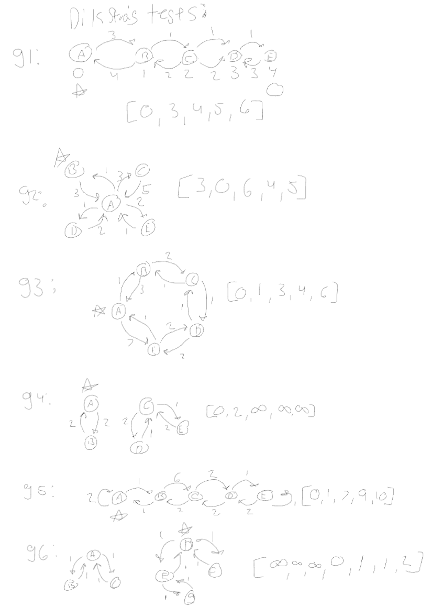

# Dijkstra's Algorithm

Recall the pseudocode for Dijkstra's algorithm:
- initialize the dist to each vertex to $\infty$, source to 0
- while there are unmarked vertices left in the graph
    - select the unmarked vertex $v$ with the lowest dist
    - mark $v$ with distance dist
    - for each edge $(v,w)$
        - dist($w$) = min $\left(\textrm{dist}(w), \textrm{dist}(v) + \textrm{weight of }(v, w)\right)$

Implement Dijkstra's algorithm. Start with the template I provided in `code.js`
and test your new function.

I have not provided any test code, but you can base yours on test code from
other exercises. Your tests must check the correctness of the result of running
the function and run automatically when you commit through a GitHub action.

The choice of data structures is up to you -- your implementation does not have
to be the most efficient one, but please make sure that it is not unnecessarily
inefficient.

## Runtime Analysis

What is the big $\Theta$ complexity of your implementation? Add your
answer, including your reasoning, to this markdown file.

tests i made up and hand solved:

my implementation has 2 main nested forloops with a priority que at the top of all of those.
The priority queue at worst will have to loop though all of the items inside to add to the queue but this will only ever happend a maximum of |v| times because every node in the graph is pushed to the queue only once so its a |v| ammount of work. on average though a priority queue has a runtime of log(|v|) because of the fact that we may insert items anywhere inside of the queue meaning that lots of the time there is less than |v| ammount of work to do. 

the outer forloop runs graph.length times and the inner for loop runs graph.length times aswell, so |v| * |v| times. only if there is an island in the graph is this not the case and if that happens the loops will be cut short so less than |v|^2.

So as far as i can tell the algorithm runs $|v| * |v| * log(|v|) \in \theta(log(|v|)|v|^2)$ 

sources:
https://www.youtube.com/watch?v=EFg3u_E6eHU was useful in figuring out what the algorithm was.
the priority que is coppied and pasted from the frist result on google.

I certify that I have listed all sources used to complete this exercise, including the use of any Large Language Models. All of the work is my own, except where stated otherwise. I am aware that plagiarism carries severe penalties and that if plagiarism is suspected, charges may be filed against me without prior notice.